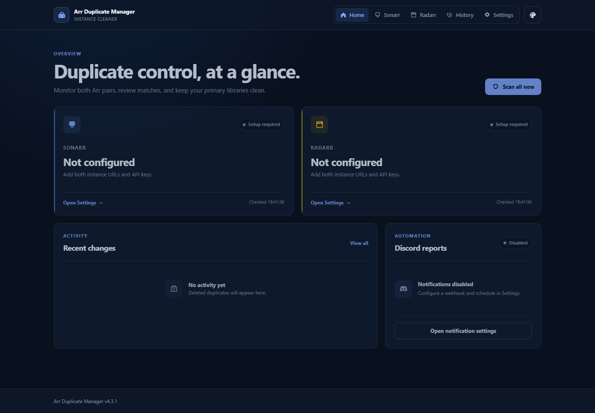
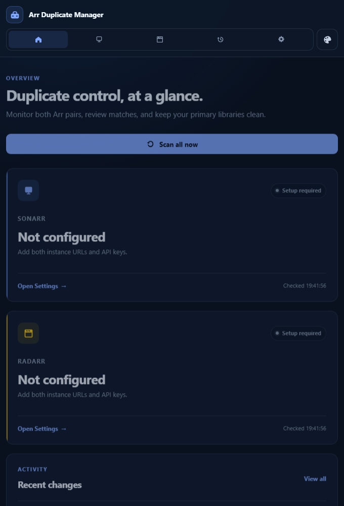

# 🚀 Arr Duplicate Manager

Arr Duplicate Manager is a lightweight web dashboard that checks two instances of
the same application for duplicate content. It compares Sonarr A with Sonarr B
and Radarr A with Radarr B, then shows series or movies that exist in both
instances. Duplicates can be removed from the configured primary instance.

The existing image, Compose service, and container identifiers remain
`arr-stack-manager` for compatibility with current installations.

## Screenshots

### Home dashboard



### Compact layout



## What the application compares

The application is designed for users who operate two separate instances of
Sonarr, Radarr, or both:

| Primary instance | Reference instance | Duplicate identifier |
| --- | --- | --- |
| Sonarr A | Sonarr B | TVDB ID |
| Radarr A | Radarr B | TMDB ID |

An item is considered a duplicate when the same identifier exists in both
instances. Instance A is the primary instance where deletion is available.
Instance B is only used as the comparison reference and is not modified.

## Features

- Check two Sonarr instances for duplicate series by TVDB ID
- Check two Radarr instances for duplicate movies by TMDB ID
- Enable only the Sonarr and Radarr integrations you use
- Test every URL and API key directly from Settings
- Use a compact Home dashboard with connection state, duplicate counts, recent
  activity, and the next Discord report
- Choose from six built-in color themes saved locally in the browser
- Show the file and episode status of matching items
- Remove items and their files from the configured primary instance
- Keep a history of the last 100 deletions
- Send optional scheduled duplicate reports to Discord
- Display the installed version and notify when an update is available
- Store all persistent data in a freely selectable host directory
- Run as a small Docker container based on Python Slim

## How persistence works

The application and its templates are part of the Docker image. Only data that
must survive container updates is written to `/config` inside the container.

The selected host directory will contain:

| File | Purpose |
| --- | --- |
| `config.json` | Sonarr/Radarr URLs and API keys |
| `history.json` | The last 100 deletion events |
| `notification_state.json` | Last scheduled Discord notification attempt |

Recreating or updating the container does not remove these files as long as the
same host directory is mounted to `/config`.

## Requirements

- Docker Engine or Docker Desktop
- Docker Compose v2
- Network access from the container to the configured Sonarr/Radarr instances
- Network access to `ghcr.io` for image downloads

## Installation with Docker Compose

Create a new directory for the Compose project and save the following content as
`compose.yaml`:

```yaml
services:
  arr-stack-manager:
    image: ghcr.io/maomao63/arr-stack-manager:latest
    pull_policy: always
    container_name: arr-stack-manager
    restart: unless-stopped
    ports:
      - "5005:8000"
    volumes:
      - "${CONFIG_PATH:-./config}:/config"
    environment:
      TZ: "${TZ:-Europe/Berlin}"
```

Start the application:

```bash
docker compose up -d
```

The image is published for `linux/amd64` and `linux/arm64`. No local source
checkout or image build is required.

Open the dashboard at:

```text
http://localhost:5005
```

When Docker runs on another server, replace `localhost` with that server's IP
address or hostname.

## Choosing the config directory

If `CONFIG_PATH` is not set, persistent files are stored in a `config` directory
next to `compose.yaml`:

```text
arr-stack-manager/
├── compose.yaml
└── config/
    ├── config.json
    ├── history.json
    └── notification_state.json
```

To choose another location, create a file named `.env` next to `compose.yaml`:

```env
CONFIG_PATH=/path/to/arr-stack-manager
TZ=Europe/Berlin
```

Example paths:

```env
# Linux
CONFIG_PATH=/opt/arr-stack-manager

# Unraid
CONFIG_PATH=/mnt/user/appdata/arr-stack-manager

# Windows with Docker Desktop
CONFIG_PATH=C:/docker/arr-stack-manager
```

Only change the host path. The container path must remain `/config`.

You can verify the resolved configuration before starting the container:

```bash
docker compose config
```

## First-time setup

1. Open the dashboard in your browser.
2. Select **Settings**.
3. Enable the Sonarr and/or Radarr integrations you want to use.
4. Enter the URL and API key for both instances of each enabled application.
5. Use **Test connection** for Instance A and Instance B. A successful URL and
   API-key combination displays **Connected** in green.
6. Save the configuration.

Instance A is the primary instance from which items can be deleted. Instance B
is used as the comparison reference. The container must be able to reach the
URLs entered in Settings. Disabling an integration hides it from navigation and
prevents API requests, deletion requests, and Discord checks for that application.
The stored URLs and API keys are retained and become available again when the
integration is re-enabled.

## Discord notifications

Discord reports are optional and disabled by default. They run inside the
application container, so no host cron job, additional Python script, or Docker
socket mount is required.

To configure notifications:

1. Create a webhook in the desired Discord channel.
2. Open **Settings** in Arr Duplicate Manager.
3. Enable **Discord notifications** and paste the webhook URL.
4. Select a daily, weekly, or monthly schedule and the report time.
5. Use **Send test report** to verify the webhook and Arr connections.
6. Save the configuration.

The report checks every enabled integration. It lists duplicates when they are
found and explicitly reports **No duplicates found** when an application has no
matching items. Enabled applications without complete connection settings are
shown as not configured. Disabled applications are omitted from the report.

Daily reports run every day at the selected time. Weekly reports also use the
selected weekday. Monthly reports use a selectable day from 1 through 28 so the
schedule remains valid in every month. Scheduling uses the container timezone
configured through `TZ` in Compose.

The scheduler records its most recent attempt in `notification_state.json` to
avoid duplicate reports after a container restart. The test button sends a
report immediately and works independently of the enabled switch.

## Home dashboard and themes

The Home dashboard loads immediately and checks enabled Sonarr and Radarr
integrations in the background. It shows connection state, current duplicate
counts, recent deletion activity, and the configured Discord schedule. Use
**Scan all now** to refresh both integration cards on demand.

The palette button in the upper-right corner offers six presets:

- **Ocean** - the original blue palette and current default
- **Aurora** - violet with teal accents
- **Ember** - warm orange and amber
- **Forest** - emerald and lime
- **Rose** - rose and magenta
- **Graphite** - neutral monochrome with a gold accent

Theme selection is stored in the browser and does not modify `config.json`, so
different users or browsers can choose their own appearance independently.

## Updating

The installed version is displayed in the footer. The application checks the
project's `VERSION` file on GitHub and shows an update notice when a newer
version is available. If GitHub cannot be reached, the rest of the application
continues to work normally.

The Compose template uses `pull_policy: always`, so deploying the stack checks
GitHub Container Registry for a newer `latest` image. To update manually, run:

```bash
docker compose pull
docker compose up -d
```

In management platforms such as Komodo, use **Pull Image** followed by
**Redeploy**, or simply deploy when the platform honors `pull_policy: always`.

The files in the configured host directory remain intact during an update.

## Useful commands

View container status:

```bash
docker compose ps
```

Follow application logs:

```bash
docker compose logs -f arr-stack-manager
```

Restart the application:

```bash
docker compose restart arr-stack-manager
```

Stop and remove the container:

```bash
docker compose down
```

This does not delete the configured host directory.

## Troubleshooting

### The dashboard does not open

Check that the container is running and review its logs:

```bash
docker compose ps
docker compose logs arr-stack-manager
```

Also make sure port `5005` is not already used by another application. You can
change the host port without changing the container port:

```yaml
ports:
  - "8080:8000"
```

### Sonarr or Radarr cannot be reached

- Verify the URL and API key in Settings.
- Make sure the URL is reachable from inside Docker.
- Do not use `localhost` for another container or host service unless the
  service actually runs inside the Arr Duplicate Manager container.
- When services share a Docker network, use their Compose service names.

### Configuration is lost after an update

Confirm that the volume maps a persistent host directory to `/config`:

```yaml
volumes:
  - "${CONFIG_PATH:-./config}:/config"
```

Do not mount the appdata directory to `/app`; that would hide the application
code included in the image.

## Security notice

The current application does not provide user authentication. Keep it on a
trusted private network or protect it with an authenticated reverse proxy. Do
not expose it directly to the public internet. API keys and the Discord webhook
are stored in `config.json`; restrict access to the persistent config directory
and never publish that file.
